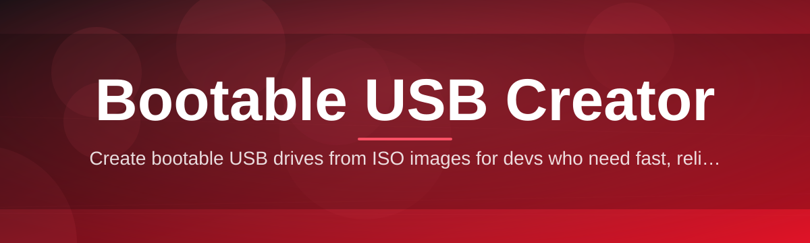

# bootable-usb-tool 💽🚀

  

*Turn any ISO into a bootable drive without touching a command line.*

  

---

### 📋 At a Glance

| Requirement | Details |
|---|---|
| **Operating System** | Windows 10 (64-bit) or Windows 11 |
| **Disk Space** | ~40 MB for the tool itself; destination USB sized to your ISO |
| **Privileges** | Administrator rights (required for raw disk writes) |
| **Dependencies** | None — fully standalone, no runtime to install |
| **USB Media** | 4 GB minimum, 8 GB+ recommended for modern Windows/Linux images |
| **Internet** | Only needed to download the tool itself |

> [!NOTE]
> `bootable-usb-tool` ships as a single portable executable. There is nothing to unpack, register, or configure before your first use.

---

### ⚖️ How It Stacks Up

| Capability | bootable-usb-tool | Generic Imaging Scripts | Built-in Windows Tools |
|---|---|---|---|
| Graphical interface | ✅ Clean, guided UI | ❌ Terminal only | ⚠️ Limited, buried in menus |
| Multi-ISO support (Windows/Linux/Rescue) | ✅ | ⚠️ Varies by script | ❌ Windows-focused only |
| Partition scheme control (MBR/GPT) | ✅ Explicit toggle | ⚠️ Manual flags | ❌ Rarely exposed |
| Persistent settings/profiles | ✅ | ❌ | ❌ |
| Write verification pass | ✅ Built-in | ⚠️ Manual | ❌ |
| Dependency footprint | ✅ Zero | ⚠️ Runtime required | ✅ Native |
| Learning curve | ✅ Minutes | ❌ Steep | ⚠️ Moderate |

---

## 🧭 Overview

Every technician, hobbyist, and system builder eventually hits the same wall: an ISO file sitting on the desktop, a USB stick in hand, and no reliable way to bridge the two without wrestling with disk utilities that were designed for engineers, not end users. `bootable-usb-tool` exists to close that gap. It is a purpose-built **bootable USB creator** for Windows that takes an ISO image — a Windows installer, a Linux distribution, a diagnostic or rescue environment — and writes it to removable media in a way that boots reliably on real hardware, not just in theory.

The project grew out of a simple observation: most existing USB flashing utilities either assume deep familiarity with partition tables and boot sectors, or they oversimplify to the point of failing silently on less common firmware configurations. `bootable-usb-tool` sits in the middle. It automates the parts that are genuinely mechanical — partition alignment, filesystem selection, boot sector staging — while surfacing the decisions that actually matter, like MBR versus GPT, in plain language.

This tool is for IT technicians re-imaging fleets of machines, hobbyists building a Linux distro-hopping USB, system administrators keeping a rescue toolkit current, and everyday users who just need Windows installed on a machine that shipped without a drive. If you have ever typed `diskpart` into a terminal and hoped you selected the right disk number, this tool was built with you in mind.

---

## 🔥 What It Actually Does

- **ISO-to-USB in one guided pass** — point the tool at an image file and a target drive; it handles partitioning, formatting, and file extraction as a single coordinated operation rather than a checklist of manual steps.

- **Dual boot-scheme awareness** — toggles cleanly between MBR (legacy BIOS) and GPT (UEFI) layouts, so the resulting drive actually boots on the firmware you're targeting instead of guessing.

- **Filesystem selection that matches the image** — automatically favors FAT32 or NTFS depending on payload size and target compatibility, avoiding the classic "4GB file won't copy" dead end with oversized Windows install images.

- **Write verification pass** — after writing, the tool re-reads critical sectors to confirm the image landed intact, catching flaky USB controllers or failing flash chips before you walk away.

- **Drive safety interlocks** — before any write begins, the destination disk is fingerprinted (size, label, partition count) and shown back to you, reducing the odds of formatting the wrong volume.

- **Multi-image library** — recent ISOs used are remembered locally, so re-flashing the same rescue or installer image later doesn't require re-browsing your filesystem.

- **Progress telemetry that means something** — instead of a vague spinner, you see write speed, estimated time remaining, and which stage (partition, format, copy, verify) is currently running.

- **Silent/unattended mode** — technicians preparing multiple drives can script repeatable creation jobs without manual clicking on each one.

> [!TIP]
> If you regularly flash rescue or diagnostic images, save your last-used ISO path and target settings as a profile — the tool will pre-fill them on next launch.

---

## 🚦 Up and Running

Getting from download to a working bootable drive takes four steps:

1. **Visit the landing page** — use the download button above or below to reach the official project page.

2. **Download the executable** — grab the current release build; no installer, no bundled extras.

3. **Run it as Administrator** — right-click the executable and choose "Run as administrator." Raw disk writes require elevated privileges on Windows.

4. **Select your ISO and destination drive, then start the write** — confirm the drive fingerprint shown on screen, choose your boot scheme, and let the tool finish partitioning, formatting, and verifying.

> [!IMPORTANT]
> Back up anything on the target USB drive first. The write process is destructive by design — it has to be, to produce a clean bootable filesystem.

---

## 🖥️ System Requirements

| Category | Minimum |
|---|---|
| OS | Windows 10 64-bit (build 1809+) or Windows 11 |
| CPU | Any x64 processor from the last decade |
| RAM | 512 MB free during operation |
| Storage | 40 MB for the tool, no cache left behind after use |
| USB Port | USB 2.0 minimum; USB 3.0+ recommended for large images |
| Permissions | Local Administrator (required for disk-level access) |

  

There is nothing else to install — no .NET redistributables, no runtime frameworks, no background services. The executable is the entire application.

---

## ⚙️ How It Works

Under the hood, the tool follows a deliberately linear pipeline. Each stage completes and validates before the next begins, which is why partial or corrupted writes are rare even on flaky hardware.

1. **Image inspection** — the ISO is scanned to determine its boot mode (legacy, UEFI, or hybrid) and total payload size.
2. **Disk preparation** — the target USB is unmounted, its existing partition table is cleared, and a new one is written matching the selected scheme.
3. **Filesystem formatting** — FAT32 or NTFS is applied based on the image's largest single file and target boot compatibility.
4. **File transfer** — contents are copied sector-by-sector or file-by-file depending on image type, with boot files staged last.
5. **Verification** — checksums of critical boot sectors and key files are compared against the source image.

> [!NOTE]
> The verification stage is optional but strongly recommended — disabling it saves a minute or two but removes your only automated confirmation that the drive will actually boot.

---

## 🧩 Troubleshooting

**Q: The tool doesn't detect my USB drive at all.**
A: Confirm the drive is mounted and visible in Windows Explorer first. Some USB-C to USB-A adapters and certain card readers don't expose disk-level access needed for raw writes.

**Q: My ISO copies fine but the machine won't boot from the finished USB.**
A: Check that the target machine's boot mode (Legacy/UEFI) matches the partition scheme you selected during creation. A GPT-formatted drive won't boot on a strictly legacy BIOS without CSM enabled.

**Q: The write process seems to freeze at a specific percentage.**
A: This usually indicates a failing or counterfeit flash drive with fake capacity reporting. Try a different, known-good USB stick and compare write speeds.

**Q: I get an "Access Denied" error immediately on launch.**
A: The tool needs Administrator privileges to write directly to disk. Right-click the executable and select "Run as administrator."

**Q: FAT32 formatting fails on a large Windows ISO.**
A: Some Windows installation images contain a single file exceeding FAT32's 4 GB limit. The tool will automatically fall back to NTFS in this case — ensure your target hardware supports booting from NTFS-formatted UEFI media.

**Q: Verification reports a mismatch after a successful-looking write.**
A: This almost always points to a hardware-level issue with the USB drive itself rather than the tool. Reformat and retry with a different physical drive before assuming software error.

---

## 🎨 UI / UX Details

The interface favors clarity over density — every screen answers one question at a time: which image, which drive, which settings, then go.

<strong>Keyboard shortcuts</strong>

| Shortcut | Action |
|---|---|
| `Ctrl + O` | Open ISO file browser |
| `Ctrl + R` | Refresh detected drive list |
| `Ctrl + Enter` | Start the write process |
| `Esc` | Cancel an in-progress operation |
| `F1` | Open in-app help panel |

<strong>Themes and appearance</strong>

- Light and dark themes, following the Windows system setting by default
- High-contrast mode for accessibility
- Adjustable UI scale for high-DPI displays

<strong>Settings that persist</strong>

- Last-used ISO directory
- Preferred partition scheme (MBR/GPT)
- Verification on/off default
- Recently used image history (local only, never uploaded)

> [!WARNING]
> Disabling drive safety confirmations in Advanced Settings removes the "are you sure" prompt before writes. Only disable this if you're scripting unattended, repeated drive creation.

---

## 🤝 Contributing & Community

Contributions, bug reports, and feature discussions are welcome. Before opening a pull request:

- Check existing issues to avoid duplicate reports
- Describe your Windows build number and USB hardware when re